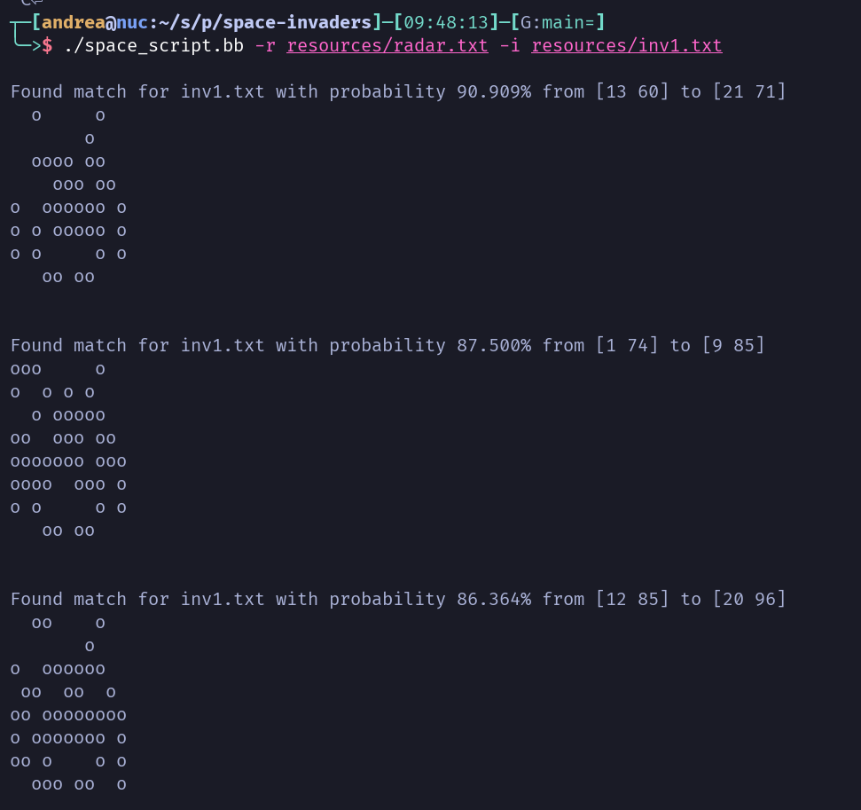

[](https://github.com/AndreaCrotti/space-invaders/actions/workflows/test.yml)

# Space invaders

Run for example with babashka:

```sh
./space_script.bb -r test/resources/radar.txt -i test/resources/inv1.txt
```

Pass multiple invaders files with:

```sh
./space_script.bb -r test/resources/radar.txt -i test/resources/inv1.txt test/resources/inv2.txt
```


And you can change the fuzziness level with:

```sh
./space_script.bb -r test/resources/radar.txt -i test/resources/inv1.txt -f 0.6
```

Which means that any shape that matches at least 60% would be detected.

The output would look something like:


## Testing

Tests are in the [space_test.clj file](./test/space_test.clj), and you can run them [./kaocha](./kaocha), which will also generate the test coverage report.
Tests and linting (with the [lint script](./lint)) also run as [github actions](https://github.com/AndreaCrotti/space-invaders/actions).

There are no unit tests for the babashka script, but it's also tested in CI, just by running the command and grepping for a string:

```yaml
    - name: Run full command and check that matches are found
      run: ./space_script.bb -r test/resources/radar.txt -i test/resources/inv1.txt -f 0.9 | grep "Found match"
```

## Implementation

The implementation is as functional as possible, all the functions are just manipulating data structures.

The arguments parsing is in the [babashka script](./space_script.bb).

The main data structure is a vector of strings like:

```clojure
["ooo" "--o" "o-o"]
```

and we use that to represent both the radar content and the invaders.
To find the matching invaders we generate all the possible rectangles from the radar of the same shape of the radar, and compute the ratio of matching characters.

To handle edges we also go outside of the boundaries of the overall matrix.

This strategy is overall not very efficient, since every extra invader would cause a full re-analysis of the matrix.
However, for the purpose of this exercise I didn't try to make the solution efficient, and just focused on clean and simple code.

Even using this same algorithm, one easy thing to do would be to use the [core.matrix library](https://github.com/mikera/core.matrix), which should significantly speed up all the operations on the matrix.
